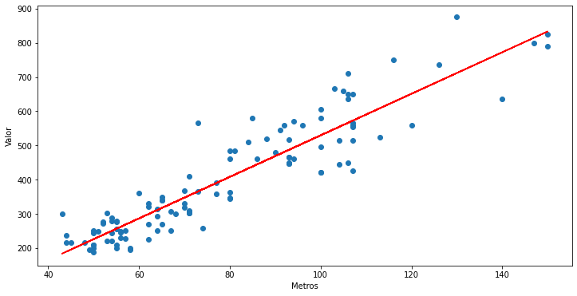

<h1 align="center">Machine Learning - regressão</h1>

<h3 align="center">Projeto desenvolvido para avaliação da disciplina Disruptive Architectures - IOT, IOB AND IA. O conteúdo que se segue nesse README foi escrito baseado no projeto e nas instruções do professor.</h3>

    

## Resumo

Com o dataset fornecido sobre dados de imóveis em São Paulo, o objetivo final é prever o preço de um apartamento numa determinada condição. O intuito do projeto é analisar os dados tanto com gráficos quanto com estatísticas e, com isso, determinar o melhor modelo de machine learning para realizar a tarefa designada.

## Instruções do professor

Parabéns! Você foi contratado por uma empresa inovadora do ramo imobiliário como `QuintoAndar, Loft, Terraz, grupo Zap (ZAP, Viva Real, DataZAP, FipeZAP, SuaHouse, Geoimóvel, Sub100 e Conecta Imobi) ou Imobi Conference`. 

O seu desafio está no apto à tomada de decisão baseada em dados (empresa data driven). 

Nesse sentido, use a base de dados **aptos.csv** para realizar a descoberta do conhecimento e responder a pergunta: 

**`Quanto vale um apartamento de 72m2 com 2 quartos, 2 vagas, reformado no Centro?`**

## Autor
Feito por [@fernandogong](https://github.com/fernandogong).

LinkedIn: [Fernando Gong](https://www.linkedin.com/in/fernando-gong/)  
Email: [fernand0cg0ng@gmail.com](mailto:fernand0cg0ng@gmail.com)
